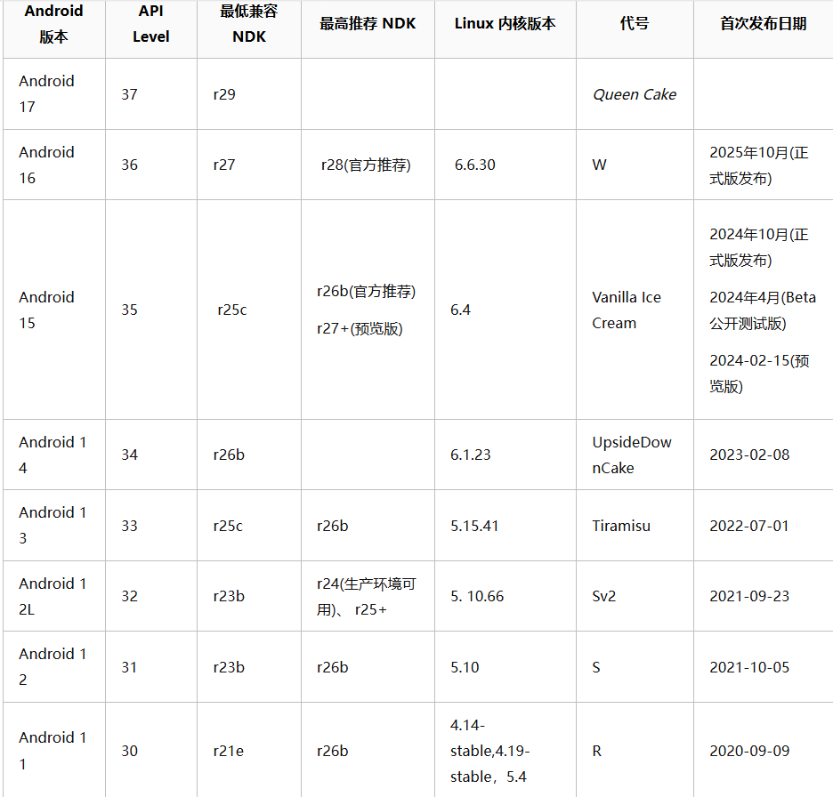

# 课题用手机型号选择调研报告

**调研目的：** 为「eBPF 探针采集 + 任务调度助手 + 对照实验」课题选择合适实验机，在预算与周期约束下最大化**可解锁、可 root、eBPF 可落地、实验可复现**的概率。

**适用课题假设：** 自定义 eBPF 程序需在真机加载；执行层至少包含用户态策略验证；希望具备较完整社区资料与排障路径。

---

## 一、选型目标与硬约束

### 1.1 课题对设备的本质要求

| 维度 | 说明 |
|------|------|
| **可开发调试** | 稳定 `adb` / `fastboot`，便于批量跑场景与日志归档，建议选用内核版本在5.10及以上，安卓系统13及以上的手机，其支持的eBPF技术较为全面 |
| **可解锁引导程序** | 无锁或官方可解锁；**运营商锁版**风险极高 |
| **可获取特权** | 自定义 eBPF 在 Android 上通常需 **root 或等价能力**（以实机验收为准） |
| **内核与策略** | 内核具备基础 BPF 能力；具体以 `CONFIG_BPF_*`、最小探针 PoC 为准 |
| **可复现** | 能固定 **系统 build** 与 **内核版本**，避免实验中途大版本漂移 |

### 1.2 不建议作为「唯一主实验机」的典型情况

- 无法解锁 bootloader，或解锁流程不可行  
- 仅支持临时 root / 厂商限制强，attach 频繁失败  
- 入门机性能过弱，调度压力场景难以产生稳定对比信号  
- 社区资料极少，出问题难以救砖或无法对齐工具链  

---

## 二、评价维度与权重建议（课题组可调整）

| 维度 | 建议权重 | 说明 |
|------|----------|------|
| **解锁与 root 可行性** | 高 | 决定 eBPF 自定义能否落地 |
| **社区与文档** | 中高 | 影响排障成本与进度风险 |
| **内核代际与 eBPF 生态** | 中高 | 新 GKI 通常更利于工具链与 BTF/CO-RE（仍以实测为准） |
| **性能档位（CPU/GPU）** | 中 | 影响调度压力与指标方差 |
| **预算与二手可得性** | 中 | 影响采购落地 |
| **sched_ext 等内核级扩展** | 低（默认） | 量产机通常不承诺；应独立走虚拟化/自定义内核 |

---

## 三、候选路线对比（摘要）

### 3.1 Google Pixel 系列（以 Pixel 6a 为代表）

| 项目 | 内容 |
|------|------|
| **优势** | 官方开发者友好；**无锁版**解锁路径清晰；Magisk 生态成熟；论文叙事中「reference 设备」易解释 |
| **风险点** | 需规避**运营商合约锁**导致无法解锁；需注意地区版本差异 |
| **适用** | **首推作为 eBPF 主实验机**（在确认可解锁前提下） |

### 3.2 小米 / 红米（以 K 系列与入门机对比）
**注意：** 小米目前的澎湃系统不支持解锁BL，之前的MIUI系统官方有相关的通道和途径，但是这个机型普遍较老，linux内核版本过低，eBPF技术不全，总体来看，不太适合。
| 子类 | 代表 | 优势 | 风险点 |
|------|------|------|--------|
| **中高端** | Redmi K50 / K50 Pro 等 | 性能强、场景压力大；国内资料多 | 联发科平台国际 ROM 资料可能偏少；仍要验证 eBPF PoC |
| **入门** | Redmi 13C 等 | 便宜 | 性能信号弱；**第三方 ROM/内核资源少**；eBPF 与策略限制问题更常见 |

**结论：** 小米系可作为实验机，但应优先选**解锁生态成熟、社区资料多**的型号；入门机更适合**流程验证**，不适合作为唯一主平台。

### 3.3 其他品牌（简述）

- **一加 / 部分机型**：解锁政策因时期与地区变化大，采购前需逐台核实。  
- **OPPO / vivo 等**：多数机型解锁与 root 门槛偏高，不适合作为「eBPF 自定义必达」课题的第一选择，除非已有明确可行方案。

---

## 四、典型反面案例（供报告风险提示）

以下情况会导致课题在「eBPF 自定义」主线上高风险：

1. **Android 12 + 老内核（如 4.19）且无 JIT**：仍可能存在基础 BPF，但性能与兼容性压力更大，需以 PoC 为准。  
2. **声称 root 但 BPF 相关路径只读/策略拦截**：可能出现“有 root 仍无法完成 attach”的情况。  
3. **仅依赖第三方 ROM 才能用 eBPF**：若该机型无成熟 ROM，则不应作为主线依赖。

---

## 五、采购前最小验收清单（强烈建议执行）

1. **OEM 解锁**：开发者选项中是否存在且可开启（Pixel）；或小米解锁流程是否可走。  
2. **fastboot**：PC 能识别设备，`fastboot devices` 正常。  
3. **非合约锁**：尤其美版 Pixel，需确认可解锁版本。  
4. **到手后**：记录 `getprop` 关键字段、`uname -r`、计划固定的系统版本（尽量减少自动升级）。  
5. **eBPF 门禁（root 后）**：最小探针 **load + attach + ringbuf 读出** 成功，再扩大采集面。

---

## 六、综合结论与建议（可直接写进立项）

1. **若课题主线包含「自定义 eBPF 探针 + 真机闭环实验」**：优先选择 **可解锁的 Google Pixel（如 Pixel 6a）**，并在采购阶段排除运营商锁版本。  
2. **若预算受限需红米等机型**：优先选 **社区成熟的中高端机型**，避免将入门机作为唯一主实验平台。  
3. **sched_ext / 自定义内核级调度**：默认不绑定零售手机；应在 **Cuttlefish/自定义内核** 或明确具备条件的平台验证。  
4. **最终判定标准**：不以品牌宣传为准，而以 **解锁可行性 + root + eBPF 最小 PoC + 固定 build** 四门门禁同时通过为准。

---

## 七、附录：建议写入实验记录的字段

| 字段 | 示例 |
|------|------|
| 机型与市场版本 | Pixel 6a，国际无锁 |
| Android 版本 / build | 14 / `BPxx.xxx` |
| 内核 | `6.1.x-android14-...` |
| 是否解锁 / root 方案 | 已解锁 / Magisk x.x |
| eBPF PoC 结果 | 通过 / 失败（附日志） |

---
